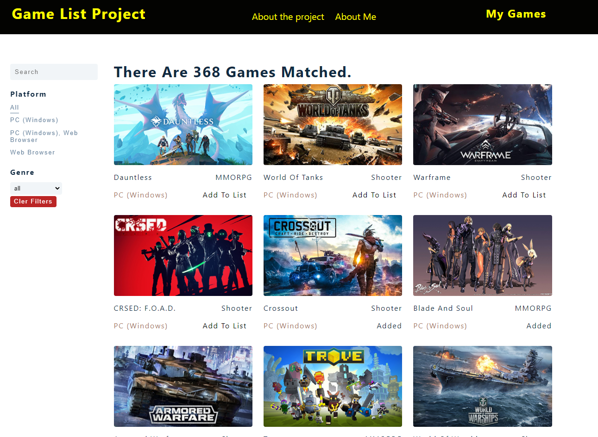
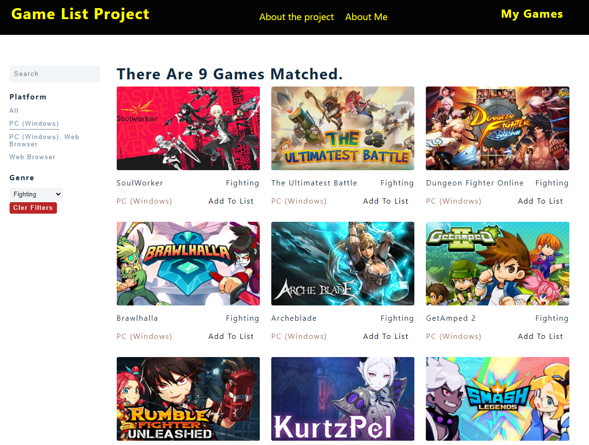
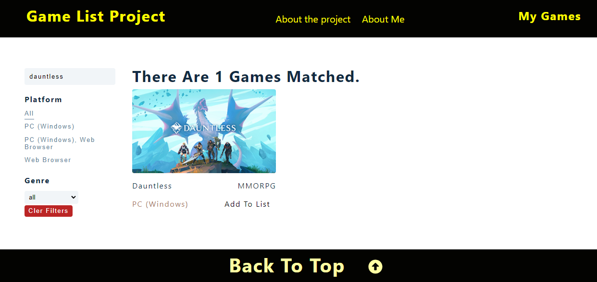
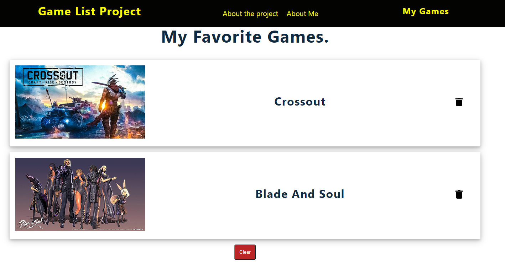

# Table of Contents
* [General Info](#general-info)
* [How to run the project](#how-to-run-the-project)
* [Application Functionalities](#application-functionalities)

# General Info
React Gamelist is a basic React application to showcase my understanding on how to build an application incorporating a number of several React Hooks such as useState, useEffect, useReducer and also state manager: Context API. Moreover, there are a few more packages involved in this project as well which are React Router and Styled Component.<br/>
Since this is a pure front-end project, there won't be any backend and the data will be stored in the local storage in you browser.
The data in this project is derived from Free-to-game API (please head over to https://rapidapi.com/digiwalls/api/free-to-play-games-database/details for more info about the API.)

# How to run the project
1. Install all the dependencies (Please check the installed packages in package.json file)
```
npm install
```

2. Start the project
```
npm start
```


# Application Functionalities
Data and state values are handled by context API which is one way of managing states across the application and any actions upon the application and dispatched by recduer functions. This is the more effective way and handling states in which makes the code more organized and readable, also avoid props drilling.
## 1.Filtering
Initailly, there are 368 games that are fetched from the API and with this, you can filter the games by either game platforms or game genres, or even apply more than one filters at the same time to obtain more desirable results. The result text at the top will change accordingly.
<br/>
<p align="center">
  This is the initail look before filtering.
  </p>


<p align="center">
and this is how it changed after filtering.
</p>

You can now see that there are only 9 games the matched with the filter of PC platform and fighting genre. Finally, if you are happy with your results and want to clear it, simply click the clear filter button to retrun to initial state.

## 2.Search
If you know a lot of cool games, you may want to search it by name, and yes this application allows you to do that. Simply type down your favourite game and it will appeat on the screen as you type. 


## 3.Gamelist
Gamelist is a function that allows users to store their favourite games and they also can remove or clear their lists as well. Technically, it is a separate React route that displays the clicked games from the home page. Data is persisted in the localstorage.

